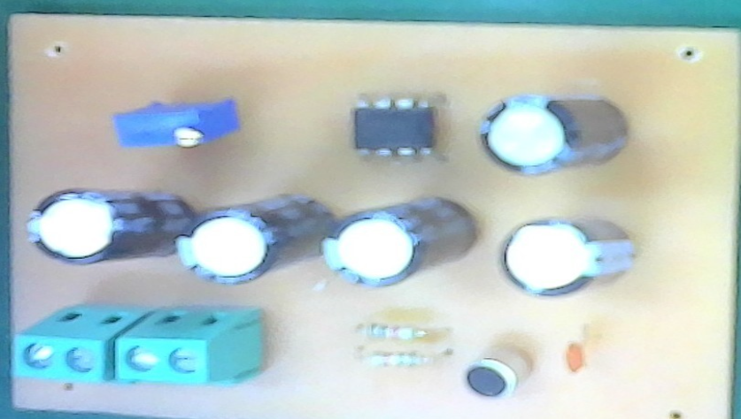
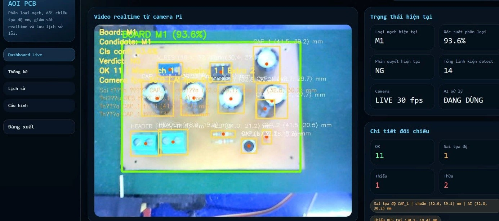

# PCB Production Line Monitoring System

## Overview

This project presents an AIoT-based PCB production line monitoring system using **YOLOv8, Raspberry Pi 4, ESP32, and MQTT**.  
The system is designed for real-time detection, classification, and quality inspection of PCB components in industrial environments.

By combining **Computer Vision and IoT technologies**, the system aims to improve inspection accuracy, reduce manual effort, and enable smart manufacturing in Industry 4.0.

---

## Key Features

- Real-time PCB component detection using YOLOv8
- Automatic classification of OK/NG products
- IoT-based communication using MQTT protocol
- Raspberry Pi 4 as the main processing unit
- ESP32 for hardware control (servo, conveyor system)
- Web-based monitoring dashboard
- Low-cost and scalable industrial solution

---

## System Architecture

The system consists of:

- **Camera/Webcam**: Captures PCB images
- **Raspberry Pi 4**: Runs YOLOv8 model for inference
- **ESP32**: Controls mechanical components
- **MQTT Server**: Handles communication between modules
- **Web Interface**: Displays real-time results

---

## Hardware Components

- Raspberry Pi 4
- ESP32 Microcontroller
- USB Camera / Webcam
- IR Sensors
- Servo Motor
- Conveyor Belt System

---

## Software & Technologies

- YOLOv8 (Object Detection)
- OpenCV (Image Processing)
- Python
- MQTT Protocol
- Flask / Web Dashboard
- Embedded C (ESP32)

---

## Dataset

A custom PCB dataset was created and annotated for training the YOLOv8 model, including:

- Electronic components
- Defective PCB samples
- Normal PCB samples

---

## Results

- High accuracy in component detection
- Real-time processing capability on Raspberry Pi 4
- Stable communication between AI and IoT modules

---

## Demo

## Future Improvements

- Improve detection speed on edge devices
- Expand dataset for more PCB types
- Integrate cloud storage for production data
- Enhance AI model accuracy

---

## Author

Developed as a research/engineering project focusing on AI + IoT applications in industrial automation.
